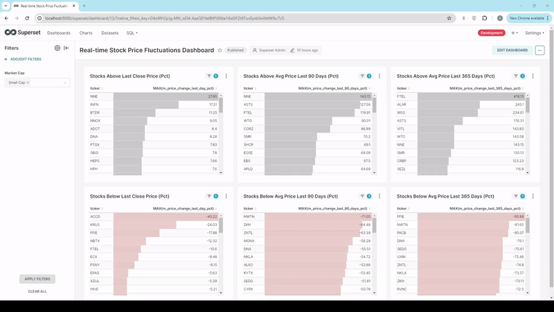
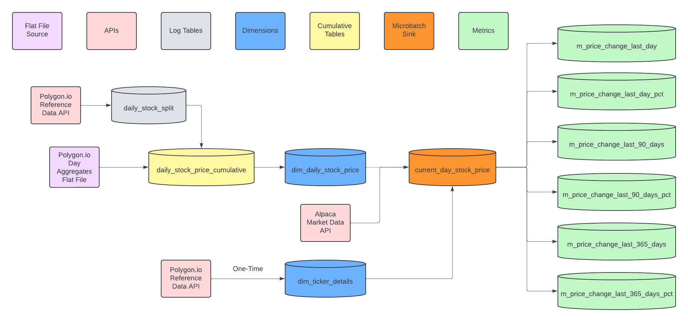
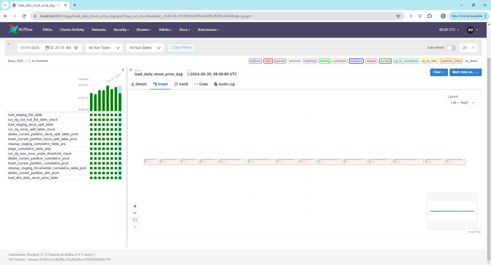
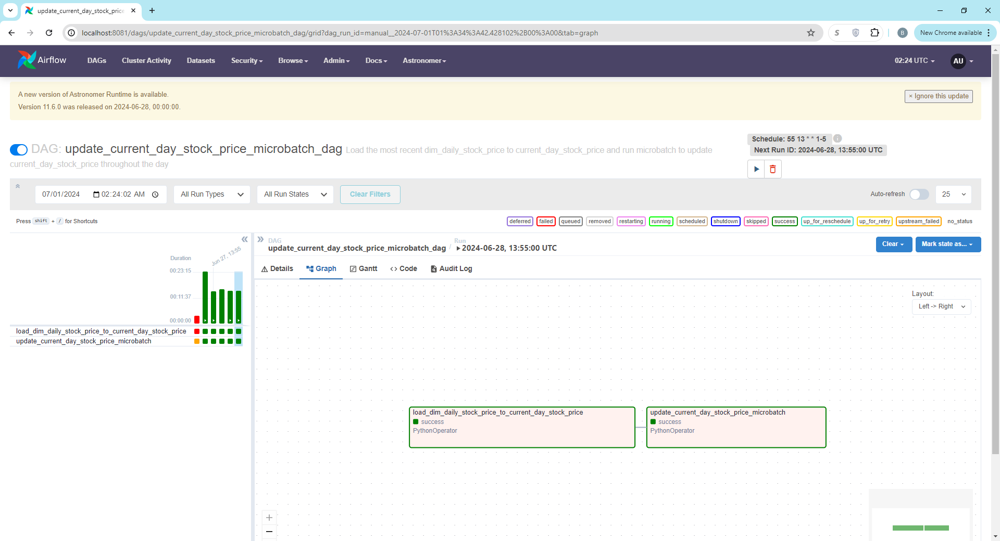

# Real-time Stock Price Fluctuations Project

## Background and Motivation
I became interested in investing during my time as a Data Analyst with the North Carolina Department of the State Treasurer, working primarily with the Retirement Systems Division, which manages pension benefits for state and local government workers in the State of North Carolina. This interest was augmented after a conversation with my parents in which they revealed that their longtime financial advisor had often been more interested in his own commission than in their financial goals. I became determined at that point to learn to manage my own investments, which has proved to be an exciting and worthwhile hobby. While most of my investing has been and will likely continue to be in indexes as first proposed by [Jack Bogle](https://www.investopedia.com/terms/j/john_bogle.asp), my desire to explore real-time, near-real-time, and short-term investment opportunitites provided a natural choice for the capstone project for the DataExpert.io V4 bootcamp.

## Scope
There are practically as many opportunities to leverage real-time data in investing as there are investment instruments themselves. For this project I considered exploring equities (stocks), credit instruments (bonds, both commercial and government), Real Estate Investment Trusts, and currency exchanges (both cryptocurrencies and currencies issued by governments). Short-term changes in price and volume in any of these categories can suggest either buying opportunities, or the need for risk management to minimize losses. As most of my experience as an investor is in traditional equities, I decided to focus there for this initial implementation, and decided to further narrow scope to comparisons of real-time stock prices against historical ones. This project is a work in progress, and the current implementation should be considered a proof-of-concept.

## Target Audience
The target audience for this initial proof-of-concept are day traders or anyone who is looking for real-time suggestions of which stocks are above or below their historical price averages in order to identify potential buying or selling situations.

## Desired Insights
The initial implementation of the project seeks to answer the following questions:
1. What are the Top 25 stocks above/below their historical price?
	- Compared with most recent
		- Daily Close Price
		- 90 Day Average
		- 365 Day Average
	- Ordered by
		- Percent, both increasing and decreasing
2. How do the above measures vary by market capitalization?

## Output
The output of the project is an Apache Superset dashboard showing the percent difference of the current price with the previous day's closing price, the average of closing prices over the previous 90 days, and the average of closing prices over the previous year. The dashboard refreshes every 30 seconds, and is filterable by market cap.

## Data sources
I considered the six data sources in the table for the project, and narrowed the list to Alpaca Markets and Polygon.io based on the support for streaming, the high API limit, and relatively low cost.

| Name           |  Monthly Price for Real-Time or Near-Real-Time    | API Limit                                         | Notes                                                                                                                                            | Real-Time Method                |
|:---------------|:--------------------------------------------------|:--------------------------------------------------|:-------------------------------------------------------------------------------------------------------------------------------------------------|:--------------------------------|
| [Alpaca Markets](https://alpaca.markets/) | $100.00                                           | Unlimited websockets; 10k API requests per minute |                                                                                                                                               | Websockets                      |
| [Alpha Vantage](https://www.alphavantage.co/)  | $250.00                                           | 1200 requests per minute                          |                                                                                                                                               | Multiple API calls (microbatch) |
| [Finnhub.io](https://finnhub.io/)     | $130.00                                           | Unlimited websockets; 300 API requests per minute |                                                                                                                                               |                              |
| [IEX Cloud](https://iexcloud.io/)      | $500.00                                           |                                                |                                                                                                                                               | Server Side Events              |
| [Polygon.io](https://polygon.io/)     | $200.00                                           | Unlimited                                         | $30 for 15-minute-delayed data and basically all other functionality. Data accounts for splits (unlike Alpaca) and has more metadata than Alpaca | Websockets                      |
| [Yahoo Finance](https://finance.yahoo.com/)  | [N/A](https://algotrading101.com/learn/yahoo-finance-api-guide/)                                               |                                                | Streaming is not supported                                                                                                                       |                              |

I initially settled on Alpaca Markets as it is half the cost of Polygon.io for real-time data. After building the initial version of the project using Alpaca APIs for both historical and current data (in a microbatch), I discovered that the Alpaca data does not account for stock splits, nor does it provide an API listing information on stock splits. This is illustrated by an early version of the dashboard reporting NVIDIA (NVDA) being down 85% compared to the previous quarter, which is obviously incorrect:

Alpaca also fails to include the market cap dimension I had planned to use as a filter. After further research on Polygon.io, I discovered that they offer a $30/month plan which includes nearly all functionality, but provides real-time data with a 15-minute delay. Polygon.io does provide an API on stock splits, accounts for stock splits in the historical API, and also provides the ability to directly download historical CSV files from S3. Using Spark to connect to the files on Polygon.io's S3 server reduced the time to stage the previous day's data from 20 minutes to 2 when compared with using the historical API. Polygon.io also provides metadata on each company (Ticker Details), from which I pulled and categorized each asset's market cap.

## Tech Stack
The tech stack for the project is as follows:
- [Starburst](https://www.starburst.io/) (Iceberg/Trino)
- [Airflow](https://airflow.apache.org/)
- [PySpark](https://spark.apache.org/docs/latest/api/python/index.html)
- Python [Requests](https://pypi.org/project/requests/) Library
- [Superset](https://superset.apache.org/)
- [AWS Glue](https://aws.amazon.com/glue/)

As part of the DataExpert.io course, students are provided access to an Iceberg data lake run by Starburst, as well as to an AWS Glue account for running Spark jobs, making these natural choices for the initial version of the project. Iceberg is a natural choice for storing batch data as most tables are stored in Parquet format, utilizing run-length-encoding compression. I considered having the dashboard source hosted in Postgres, but as a proof-of-concept Iceberg is fully functional. Once the project incorporates actual streaming data I will likely move the dashboard source to Apache Druid to take advantage of its lower latency.

Airflow and PySpark are industry standards for pipeline orchestration and batch processing, respectively. After encountering difficulties linking a websocket to Spark Streaming and Flink, I elected to move to a microbatch process to pull in data during the day. This process runs on a loop, updating each stock roughly every 4 minutes. As Spark does not provide much of an advantage with repeated API calls, and as it has a significant overhead in terms of memory and compute, I elected to use the Requests library in Python to handle the microbatch process. Spark does handle the final table update, but the API responses are stored in a list before briefly being converted to a pandas dataframe and finally to a PySpark dataframe for the final update.

I initially planned to use Tableau for the dashboard. Unfortunately in order to build a new Dashboard connected to a database (rather than a flat file) Tableau requires a [Creator](https://www.tableau.com/products/tableau#plans-pricing) license, which costs $900/year. For this reason I elected to use Apache Superset, which is open source.

## Metrics
| Metric Name		| Metric Derivation		| Description	|
|:-------------	|:---------	|:-----------------	|
| m_price_change_last_day	| current_price - close_price_last_day	| Absolute price change compared with the previous day (USD)	|
| m_price_change_last_day_pct	| 100 * (current_price - close_price_last_day) / close_price_last_day	| Percentage price change compared with the previous day (USD)	|
| m_price_change_last_90_days	| current_price - close_price_avg_last_90_days	| Absolute price change compared with the average of the previous 90 days (USD)	|
| m_price_change_last_90_days_pct	| 100 * (current_price - close_price_avg_last_90_days) / close_price_avg_last_90_days	| Percentage price change compared with the average of the previous 90 days (USD)	|
| m_price_change_last_365_days	| current_price - close_price_avg_last_365_days	| Absolute price change compared with the average of the previous 365 days (USD)	|
| m_price_change_last_365_days_pct	| 100 * (current_price - close_price_avg_last_365_days) / close_price_avg_last_365_days	| Percentage price change compared with the average of the previous 365 days (USD)	|

The grain of each metric is stock_symbol. The initial Superset dashboard displays a chart showing the top 50 stocks sorted by the three percentage metrics both ascending and descending (two charts per metric). This charts will identify potential buying/selling/short opportunities for day traders in real time. A dashboard showing the changes in absolute price will be added at a later date.

## Data and Architecture
Daily stock data is loaded from the Polygon.io Daily Aggregates Flat File into a staging table, combined with stock split data (from the Polygon.io Reference Data API), and merged into a cumulative table (daily_stock_price_cumulative) in Iceberg via a Spark job scheduled with Airflow. The daily_stock_price_cumulative table contains an array of the previous 365 days of price and volume data. This data is aggregated into a dimension table in Iceberg (dim_daily_stock_price) containing averages for comparison with real-time data. Finally, the dim_daily_stock_price is joined to the dim_ticker_details table (a one-time pull from the Polygon.io Reference Data API) to pull in the market cap dimension and load to the current_day_stock_price table, which is uploaded by the microbatch process. The architecture for the daily data flow is shown below.

The daily_stock_price_cumulative was initially populated via a backfill from the Polygon.io Daily Aggregates Flat File for the previous year. Aggregating the data in a cumulative table provided a significant reduction both in cardinality and file size, as shown the table below.

| Table Name	| Row Count	| File Size (MB)	| Description	|
|:-------------	|:---------	|:-----------------	|:-----------------	|
| staging_daily_stock_price_backfill	| 2800315	| 71.3	| Staging table for backfill of previous year. Grain is ticker and snapshot_date.	|
| daily_stock_price_cumulative	| 12900	| 42.7	| Cumulative table containing a year of price data in an array. Grain is ticker. Values are for current partition.	|
| dim_daily_stock_price	| 12900	| 0.3	| Daily dimension table containing close price for previous day, previous quarter (average), and previous year (average). Grain is ticker. Values are for current partition.	|
| current_day_stock_price	| 12895	| 0.5	| dim_daily_stock_price for current day plus market cap and intraday prices and metrics. Grain is ticker.	|

The reduced cardinality, in particular, facilitates an efficient join between dim_daily_stock_price and dim_ticker_details. The aggregated grain along with the distributed capabilities of Spark will enable this model to handle additional markets and asset types in the future.

### Table Details

#### daily_stock_split
The daily_stock_split is a log of stock splits from the Polygon.io Reference API, and is used to convert data reported in the flat files. An example, on 6/10/2024, NVIDIA had a 10:1 stock split, with a split_from of 1 and a split_to of 10, meaning each share prior to 6/10 was worth 10 shares after 6/10. This table is joined with staging price data prior to merging into daily_stock_price_cumulative.

| Column		| Type		| Comment			|
|:-------------	|:---------	|:-----------------	|
| execution_date	| VARCHAR	| Date of the stock split		|
| split_from	| DOUBLE	| Share number before the split for conversion		|
| split_to	| DOUBLE	| Share number before the split for conversion		|
| ticker	| VARCHAR	| Stock Symbol		|
| as_of_date 	| DATE		| Most recent date imported (partition key)	|

##### Data Quality Checks
- Pipeline-level checks
	- Null values in array - this would indicate invalid split ratios

If the pipeline-level check fails, daily_stock_split is not updated and the pipeline fails.

#### daily_stock_price_cumulative
The daily_stock_price_cumulative table contains one row per ticker with a year's worth of price and volume data. Is the table on which each downstream table is built.

| Column		| Type		| Comment			|
|:-------------	|:---------	|:-----------------	|
| ticker	| VARCHAR	| Stock Symbol		|
| price_array 	| ARRAY(ROW(DOUBLE, DOUBLE, DOUBLE, DOUBLE, BIGINT, DATE))	| Last 365 days of volume, open price, high price, low price, close price, transaction count, and snapshot date	|
| as_of_date 	| DATE		| Most recent date imported (partition key)	|

##### Data Quality Checks
- Pipeline-level checks
	- Null values in array - this would indicate invalid price/volume data
	- Total ticker count increases by no more than 1% day-to-day - this would likely indicate invalid ticker values

If either pipeline-level check fails, daily_stock_price_cumulative is not updated and the pipeline fails.

- Row-level checks
	- Volume > 0
	- All prices > 0

If any row-level check fails, that ticker's data is not loaded into daily_stock_price_cumulative, as a volume of 0 or any price of 0 are both invalid.
	
#### dim_daily_stock_price
The dim_daily_stock_price table contains one row per ticker with averages to be passed to the current_day_stock_price table.

| Column		| Type		| Comment			|
|:-------------	|:---------	|:-----------------	|
| ticker	| VARCHAR	| Stock Symbol		|
| close_price_last_day	| DOUBLE	| Previous day's closing price (i.e. - most recent value of price_array)	|
| close_price_avg_last_90_days	| DOUBLE	| Average of the previous 90 days of closing prices		|
| close_price_avg_last_365_days	| DOUBLE	| Average of the previous 365 days of closing prices		|
| as_of_date 	| DATE		| Most recent date imported (partition key)	|
	
##### Data Quality Checks
- Downstream from daily_stock_price_cumulative

#### dim_ticker_details
The dim_ticker_details table is (currently) a Type 0 SCD containing metadata on each ticker. This table also comes from the Polygon.io Reference Data API, but was loaded as an initial backfill rather than as part of the daily pipeline because of long load times. Regular updates to this table will be added at some point in the future. Another future enhancement to the table will be adding catagories for the industry_description to group similar businesses together.

| Column		| Type		| Comment			|
|:-------------	|:---------	|:-----------------	|
| ticker	| VARCHAR	| Stock Symbol		|
| ticker_root	| VARCHAR	| The root of a specified ticker. For example, the root of BRK.A is BRK.		|
| company_name	| VARCHAR	| The company's registered name		|
| is_actively_traded	| BOOLEAN	| Whether or not the asset is actively traded. False means the asset has been delisted.		|
| currency_name	| VARCHAR	| The name of the currency that this asset is traded with (currently all USD).		|
| country	| VARCHAR	| Currently all US		|
| asset_type	| VARCHAR	| Currently either Stocks or OTC (over-the-counter) - stocks traded without being listed on an exchange		|
| market_cap	| DOUBLE	| Total dollar value of a company's outstanding shares of stock		|
| primary_exchange	| VARCHAR	| Exchange, e.g. the New York Stock Exchange (NYSE) or Nasdaq		|
| industry_description	| VARCHAR	| Description of a stock's industry/business		|
| weighted_shares_outstanding	| DOUBLE	| Total shares of a company's stock in the market		|
| market_cap_description	| VARCHAR	| Categories of market capitalization - > $200B is Mega Cap; $10B-$200B is Large Cap; $2B-$10B is Mid Cap; $250M-$2B is Small Cap; $0-$250M is Micro Cap. Stocks with a missing the market_cap are given a value of "Not Provided" 	|
| as_of_date 	| DATE		| Most recent date imported (partition key)	|

#### current_day_stock_price
The current_day_stock_price table is the source of the Superset Dashboard. It is truncated on weekdays at 10AM ET (market open) and replaced with the current partition of dim_daily_stock_price. It includes extra columns for the current stock price and last updated time, as well as the [Metrics](#metrics) defined above. These columns are populated by a microbatch job utilizing the Python Requests library and Spark.

| Column		| Type		| Comment			|
| -------------	| ---------	| -----------------	|
| ticker	| VARCHAR	| Stock Symbol		|
| close_price_last_day	| DOUBLE	| Previous day's closing price	|
| close_price_avg_last_90_days	| DOUBLE	| Average of the previous 90 days of closing prices		|
| close_price_avg_last_365_days	| DOUBLE	| Average of the previous 365 days of closing prices		|
| m_price_change_last_day	| DOUBLE	| Absolute price change compared with the previous day (USD)		|
| m_price_change_last_day_pct	| DOUBLE	| Percentage price change compared with the previous day (USD)		|
| m_price_change_last_90_days	| DOUBLE	| Absolute price change compared with the average of the previous 90 days (USD)		|
| m_price_change_last_90_days_pct	| DOUBLE	| Percentage price change compared with the average of the previous 90 days (USD)		|
| m_price_change_last_365_days	| DOUBLE	| Absolute price change compared with the average of the previous 365 days (USD)		|
| m_price_change_last_365_days_pct	| DOUBLE	| Percentage price change compared with the average of the previous 365 days (USD)		|
| current_price 	| DOUBLE		| Current price of the stock	|
| market_cap_description	| VARCHAR	| Description of market capitalization, e.g. - "Large Cap", "Mid Cap", etc.		|
| last_updated_datetime	| DATETIME	| Date/Time of last update in UTC	|

##### Data Quality Checks
- current_price > 0

### DAGs
#### Daily DAGs
Two DAGs update the system with daily and intraday stock data. The load_daily_stock_price_dag loads the previous day's volume and price data, combines it with data on stock splits, and updates the daily_stock_price_cumulative table and the dim_daily_stock_price table for the previous day. The daily_stock_price_cumulative and daily_stock_split tables, follow a write-audit-publish pattern. Other steps are added to ensure pipeline idempotency. This DAG runs daily, including weekends.

The update_current_day_stock_price_microbatch_dag runs on Monday-Friday, and initializes the current_day_stock_price table with data from dim_daily_stock_price, and runs a microbatch to pull data from the Alpaca Historical API throughout the day to update the table, thus updating the associated dashboard. Stocks update an average of once every 4 minutes. Additional logic to account for market holidays in the scheduling of this pipeline will be added at a later date.

#### Backfills
The daily_stock_price_cumulative table and dim_ticker_details tables were both backfilled with data at the start of the project. The process to load the daily_stock_price_cumulative was similar to the daily load - data from 6/1/2023 onward was pulled from Polygon.io's Daily Aggregate Files on S3, merged with stock split data from the Polygon.io Reference API (in the stock_splits_backfill table), then the last year's worth of data was pulled for the initial partition of daily_stock_price_cumulative. 

I had originally intended for dim_ticker_details to be part of the load_daily_stock_price_dag, but since it required looping through API calls, this step took over an hour to complete. For this reason, I elected to backfill this table once for the purposes of this proof-of-concept. Regular updates to this table will be considered in the future.