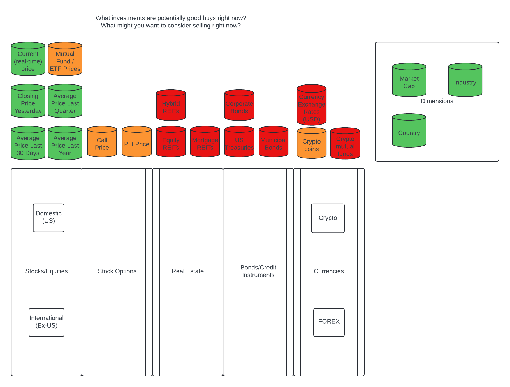
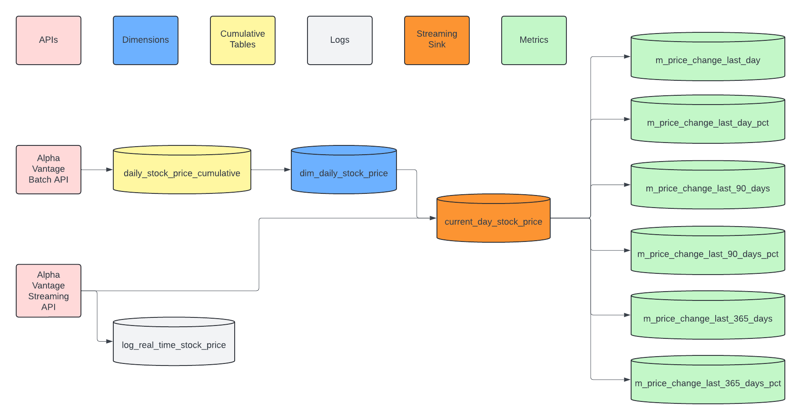

# Real-time Stock Price Fluctuations Project

## Overview
The project outlined in this proposal is to serve as the capstone project for the DataExpert.io V4 bootcamp. For the project I will build a system using lambda architecture which will compare real-time and historical stock prices and display the results in real-time to a Tableau dashboard.

## Target Audience
The target audience for this project are day traders or anyone who is looking for real-time suggestions of which stocks are above or below their historical price averages in order to identify potential buying or selling situations.

## Desired Insights
There are a myriad of questions which can be answered by combining real-time and historical investment data. These have been divided into ones which will be implemented initially and ones which will be saved for future iterations.

### Initial Implementation
The initial implementation of the project seeks to answer the following questions:
1. What are the Top 25 stocks above/below their historical price?
	- Compared with most recent
		- Daily Close Price
		- 90 Day Average
		- 365 Day Average
	- Ordered by
		- Percent
		- Dollar Value
2. How do the above measures vary by country, industry, and market capitalization?

The results for the first iteration of the project will be displayed in a Tableau dashboard.
		
### Future Implementations
Future iterations of the project will consider similar questions to the ones above, but applied to the asset classes below:
- Stock Mutual Funds
- Stock Options
- REITs
- Credit Instruments
- Currency Exchange Rates, including cryptocurrencies
	
Future iterations will also include SMS/Email alerts as well as the ability to train ML models on which situations are likely to lead to buying or selling opportunities, and to use these models to automatically execute trades.

## Metrics
| Metric Name		| Metric Derivation		| Description	|
| -------------	| ---------	| -----------------	|
| m_price_change_last_day	| current_price - close_price_last_day	| Absolute price change compared with the previous day (USD)	|
| m_price_change_last_day_pct	| 100 * (current_price - close_price_last_day) / close_price_last_day	| Percentage price change compared with the previous day (USD)	|
| m_price_change_last_90_days	| current_price - close_price_avg_last_90_days	| Absolute price change compared with the average of the previous 90 days (USD)	|
| m_price_change_last_90_days_pct	| 100 * (current_price - close_price_avg_last_90_days) / close_price_avg_last_90_days	| Percentage price change compared with the average of the previous 90 days (USD)	|
| m_price_change_last_365_days	| current_price - close_price_avg_last_365_days	| Absolute price change compared with the average of the previous 365 days (USD)	|
| m_price_change_last_365_days_pct	| 100 * (current_price - close_price_avg_last_365_days) / close_price_avg_last_365_days	| Percentage price change compared with the average of the previous 365 days (USD)	|

The grain of each metric is stock_symbol. The Tableau dashboard will display a chart showing the top 25 stocks sorted by each of the above metrics both ascending and descending (two charts per metric). This charts will identify potential buying/selling/short opportunities for day traders in real time.

## Data and Architecture
Daily stock data will be loaded from an Alpha Vantage API into a cumulative table (daily_stock_price_cumulative) in Iceberg via a Spark job scheduled with Airflow. The daily_stock_price_cumulative table will contain an array of the previous 365 days of price and volume data. This data will be aggregated into a dimension table in Iceberg (dim_daily_stock_price) containing averages for comparison with real-time data. Spark was chosen as the integration tool because of its ability to connect with APIs, and Iceberg was chosen for the compactness of data via parquet files (including support for arrays) and its relatively low storage costs.

The dimension table for the current day will then be loaded into a Postgres database where the real-time data will be added. Real-time stock prices will be loaded from an Alpha Vantage API into the Postgres table via Kafka and Flink, as well as logged to an Iceberg table for future use. The Postgres table will serve as the source for a Tableau dashboard showing real-time updates of stocks deviating from their baseline prices. Postgres was chosen for the backend of the Tableau dashboard because of cost, and because the first iteration of data is small enough for Postgres to handle. Since the Postgres table is simply the current day's snapshot with a single column for the most recent real-time price value, moving this table to another provider such as Apache Druid in the future will be a small lift. Logging the real-time metrics to Iceberg will provide a low-cost solution to enable training of ML models in the future.

### daily_stock_price_cumulative
| Column		| Type		| Comment			|
| -------------	| ---------	| -----------------	|
| stock_symbol	| VARCHAR	| Stock Symbol		|
| stock_name	| VARCHAR	| Stock Name		|
| country	| VARCHAR	| Country where company is located		|
| industry	| VARCHAR	| Primary industry of the company		|
| market_cap	| VARCHAR	| Description of market capitalization, e.g. - "Large Cap", "Mid Cap", etc.		|
| price_array 	| ARRAY(ROW(DOUBLE, DOUBLE, DOUBLE, DOUBLE, BIGINT, DATE))	| Last 365 days of open price, high price, low price, close price, volume, and date	|
| as_of_date 	| DATE		| Most recent date imported (partition key)	|

#### Data Quality Checks
- Pipeline-level checks
	- Date is a weekday
	- Row Count at least 90% of rows in cumulative table

If either pipeline-level check fails, do not update array and do not update downstream tables

- Row-level checks
	- Volume > 0
	- All prices > 0
	- Incomplete data in array

If any row-level check fails, do not update array for given stock
	
### dim_daily_stock_price
| Column		| Type		| Comment			|
| -------------	| ---------	| -----------------	|
| stock_symbol	| VARCHAR	| Stock Symbol		|
| stock_name	| VARCHAR	| Stock Name		|
| country	| VARCHAR	| Country where company is located		|
| industry	| VARCHAR	| Primary industry of the company		|
| market_cap	| VARCHAR	| Description of market capitalization, e.g. - "Large Cap", "Mid Cap", etc.		|
| close_price_last_day	| DOUBLE	| Previous day's closing price (i.e. - most recent value of price_array)	|
| close_price_avg_last_90_days	| DOUBLE	| Average of the previous 90 days of closing prices		|
| close_price_avg_last_365_days	| DOUBLE	| Average of the previous 365 days of closing prices		|
| as_of_date 	| DATE		| Most recent date imported (partition key)	|
	
#### Data Quality Checks
- See daily_stock_price_cumulative

### current_day_stock_price
The current_day_stock_price table will be stored on a Postgres database. This table will be truncated on weekdays at 10AM ET (market open), provided the dim_daily_stock_price table was updated, and replaced with the current partition of dim_daily_stock_price. It includes extra columns for the current stock price and last updated time, which will be populated by a Flink job.

| Column		| Type		| Comment			|
| -------------	| ---------	| -----------------	|
| stock_symbol	| VARCHAR	| Stock Symbol		|
| stock_name	| VARCHAR	| Stock Name		|
| country	| VARCHAR	| Country where company is located		|
| industry	| VARCHAR	| Primary industry of the company		|
| market_cap	| VARCHAR	| Description of market capitalization, e.g. - "Large Cap", "Mid Cap", etc.		|
| close_price_last_day	| DOUBLE	| Previous day's closing price	|
| close_price_avg_last_90_days	| DOUBLE	| Average of the previous 90 days of closing prices		|
| close_price_avg_last_365_days	| DOUBLE	| Average of the previous 365 days of closing prices		|
| current_price 	| DOUBLE		| Current price of the stock	|
| last_updated_datetime	| DATETIME	| Date/Time of last update in UTC	|

#### Data Quality Checks
- current_price > 0
- last_updated_datetime > existing last_updated_datetime

### log_real_time_stock_price
The log_real_time_stock_price table will log all stock price updates from Kafka to Iceberg for future use.

| Column		| Type		| Comment			|
| -------------	| ---------	| -----------------	|
| stock_symbol	| VARCHAR	| Stock Symbol (partition key)		|
| stock_name	| VARCHAR	| Stock Name		|
| stock_price 	| DOUBLE		| Price of the stock at the indicated date/time	|
| update_time	| TIME	| Time of data point in UTC	|
| update_date	| DATE	| Date of the message (partition key)	|

#### Data Quality Checks
- stock_price > 0
- all columns non-null

